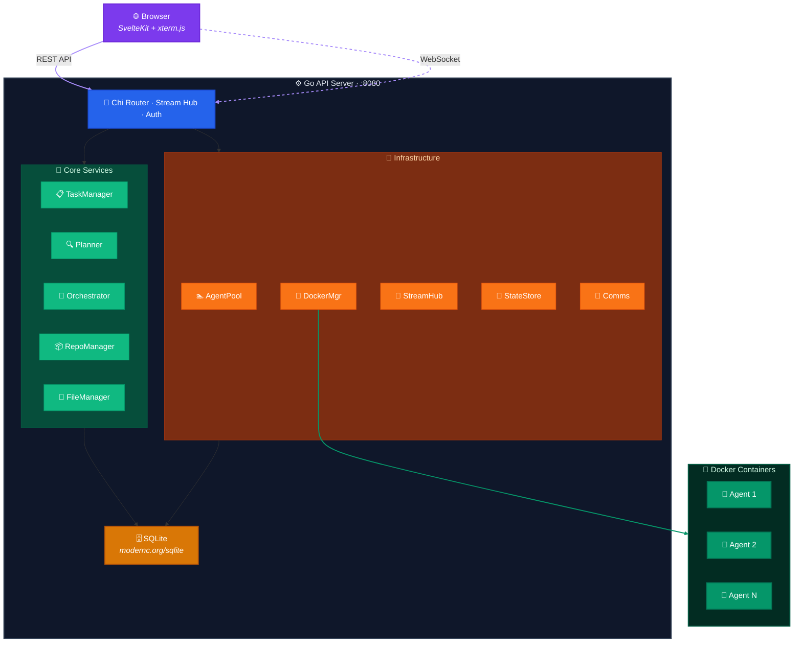
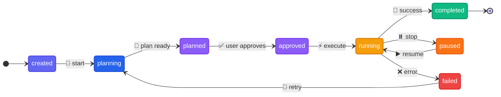

<p align="center">
  
</p>

<p align="center">
  <strong>AI Agent Orchestrator</strong> — Launch teams of Claude Code agents in Docker containers to execute complex software development tasks.
</p>

<p align="center">
  <a href="ROADMAP.md">Roadmap</a> · <a href="CONTRIBUTING.md">Contributing</a> · <a href="LICENSE">License</a>
</p>

---

Klaudio coordinates multiple AI agents working in parallel, with real-time streaming, a web interface, and Git integration. Give it a task, and it plans, executes, and delivers — with full visibility and control.

## Key Features

- **Planning-first approach** — A planner agent analyzes every task, generates a structured execution plan, and can ask clarification questions before execution begins
- **Two execution modes** — Sequential (DAG-based dependency graph) or Collaborative (manager + concurrent workers with directive-based coordination)
- **Real-time streaming** — Watch agent output live in the browser via WebSocket + xterm.js, with backfill for late joiners
- **Inter-agent communication** — Agents coordinate through filesystem directives, database messages, and API endpoints
- **Stop/Resume** — Pause any task, save full state (files, Claude memory, conversation context), and resume later in a fresh container
- **Git integration** — Clone repos, auto-commit, auto-push, and auto-create PRs on Bitbucket
- **Web UI** — Dashboard, task detail with tabs (Plan, Agents, Comms, Files), file viewer/editor, team template management
- **Ephemeral containers** — Each agent runs in a clean Docker container. State lives in volumes, never in the container

## Architecture



## Tech Stack

| Component | Technology |
|-----------|-----------|
| Backend | Go 1.25, Chi v5, gorilla/websocket |
| Database | SQLite (modernc.org/sqlite, pure Go, no CGO) |
| Containers | Docker SDK for Go |
| Frontend | SvelteKit 2, Svelte 5, Tailwind CSS |
| Terminal | xterm.js 5 |
| Git | go-git v5, Bitbucket REST v2 |

## Quick Start

### Prerequisites

- **Go 1.22+**
- **Docker Engine** running
- **Node.js 20+** (for the web UI)
- **Claude Code Max** account with config in `~/.claude/`

### 1. Build and run the backend

```bash
git clone https://github.com/klaudio-ai/klaudio.git
cd klaudio

# Build the agent Docker image
make docker-build

# Build and start the server
make run
```

The API server starts at `http://localhost:8080`.

### 2. Start the web UI (development)

```bash
cd web
npm install
npm run dev
```

The web UI is available at `http://localhost:5173`.

### 3. Create your first task

```bash
curl -X POST http://localhost:8080/api/tasks \
  -H "Content-Type: application/json" \
  -d '{
    "name": "Hello World",
    "prompt": "Create a simple Hello World program in Go",
    "auto_start": true
  }'
```

Or use the web UI at `http://localhost:5173/tasks/new`.

## Configuration

Configuration is loaded from `config.yaml` with environment variable overrides:

```yaml
server:
  port: 8080                    # KLAUDIO_PORT

docker:
  image_name: klaudio-agent
  max_agents: 5                 # Global concurrent agent limit
  max_agents_per_task: 3        # Per-task agent limit

claude:
  auth_mode: host               # "host" (mount ~/.claude/) or "env" (session key)
  # session_key: ""             # CLAUDE_SESSION_KEY (for "env" mode)

database:
  path: data/klaudio.db         # KLAUDIO_DB_PATH

storage:
  data_dir: data
  auto_save_interval: 5m
  auto_save_enabled: true
  max_checkpoints: 3
  state_retention_days: 7
```

### Claude Code Authentication

**Host mode** (default): Mounts your `~/.claude/` directory into containers as read-only.

**Env mode**: Set `CLAUDE_SESSION_KEY` environment variable. Useful for CI/CD or when `~/.claude/` is not available.

## How It Works

### Task Lifecycle



1. **Create** — Submit a task with a prompt and optional repo config
2. **Plan** — A read-only planner agent analyzes the task, may ask clarification questions, produces a structured execution plan
3. **Approve** — Review and optionally edit the plan, then approve
4. **Execute** — Agents are spawned based on the plan (sequential or collaborative mode)
5. **Monitor** — Watch real-time output, inject messages to steer agents
6. **Complete** — Results collected, optional reviewer verifies coherence

### Execution Modes

**Sequential (DAG)**: Subtasks execute in dependency order. Each subtask waits for its dependencies to complete before starting.

**Collaborative**: A manager agent spawns first and writes coordination directives. Worker agents spawn simultaneously and wait for their directive files. The manager monitors progress via API and receives lifecycle signals (`WORKER_COMPLETED`, `WORKER_FAILED`, `ALL_WORKERS_DONE`).

## Project Structure

```
klaudio/
├── cmd/klaudio/          # Application entry point
├── internal/
│   ├── api/              # HTTP handlers, Chi router, WebSocket (12 files)
│   ├── agent/            # Agent pool management
│   ├── config/           # Configuration loading (YAML + env)
│   ├── db/               # SQLite database layer (hand-written queries)
│   ├── docker/           # Docker container management
│   ├── files/            # File upload/download/transfer
│   ├── repo/             # Git operations, Bitbucket API
│   ├── state/            # Checkpoint persistence, autosave
│   ├── stream/           # Real-time streaming hub, ring buffers
│   └── task/             # Core orchestration (11 files, ~4k lines)
│       ├── manager.go        # Task lifecycle controller
│       ├── planner.go        # Read-only planner with Q&A
│       ├── orchestrator.go   # DAG-based sequential execution
│       ├── collaborative.go  # Manager + workers execution
│       ├── comms.go          # Inter-agent messaging
│       ├── dependency.go     # Dependency graph
│       ├── executor.go       # Container execution wrapper
│       ├── reviewer.go       # Optional QA reviewer
│       └── filelock.go       # File-level locking
├── docker/               # Dockerfile and entrypoint for agent containers
├── migrations/           # SQL migration files (001-005)
├── web/                  # SvelteKit frontend
│   └── src/
│       ├── routes/           # Pages (dashboard, task detail, settings)
│       └── lib/
│           ├── components/   # Terminal, PlanViewer, FileManager, AgentComms...
│           ├── stores/       # WebSocket, tasks
│           └── api.ts        # TypeScript API client
├── config.yaml           # Default configuration
└── Makefile              # Build targets
```

## API Overview

| Endpoint | Description |
|----------|-------------|
| `POST /api/tasks` | Create a new task |
| `GET /api/tasks` | List tasks (paginated, filterable) |
| `GET /api/tasks/:id` | Get task details |
| `POST /api/tasks/:id/start` | Begin planning |
| `POST /api/tasks/:id/approve` | Approve plan, start execution |
| `POST /api/tasks/:id/stop` | Pause task, save checkpoint |
| `POST /api/tasks/:id/resume` | Resume from checkpoint |
| `POST /api/tasks/:id/message` | Inject message to agents |
| `GET /api/tasks/:id/plan` | Get execution plan |
| `GET /api/tasks/:id/questions` | Get planner questions |
| `POST /api/tasks/:id/questions/:qid/answer` | Answer planner question |
| `GET/POST /api/tasks/:id/files` | Upload/list files |
| `GET/POST /api/tasks/:id/messages` | Inter-agent messages |
| `GET/POST /api/team-templates` | Team template management |
| `GET/POST /api/repo-templates` | Repository template management |
| `WS /ws/tasks/:id/stream` | Real-time agent output stream |

## Development

```bash
# Build the binary
make build

# Build and run
make run

# Build the agent Docker image
make docker-build

# Run tests
make test

# Clean build artifacts and database
make clean

# Tidy Go modules
make tidy
```

### Development Rules

1. **No CGO** — Pure Go SQLite via modernc.org/sqlite. Never add CGO dependencies.
2. **Context everywhere** — All I/O functions accept `context.Context` as the first parameter.
3. **Wrapped errors** — Always use `fmt.Errorf("doing X: %w", err)`.
4. **Hand-written SQL** — Database queries in `internal/db/queries.go`, written by hand.
5. **No global state** — Dependencies passed via structs.
6. **Structured logging** — Use `log/slog` for all logging.

## Documentation

| Document | Description |
|----------|-------------|
| [Roadmap](ROADMAP.md) | Development roadmap with implementation status |
| [Contributing](CONTRIBUTING.md) | Contribution guidelines |

## Contributing

Contributions are welcome! Please see [CONTRIBUTING.md](CONTRIBUTING.md) for guidelines.

## License

This project is licensed under the Apache License 2.0 — see the [LICENSE](LICENSE) file for details.
