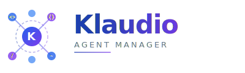
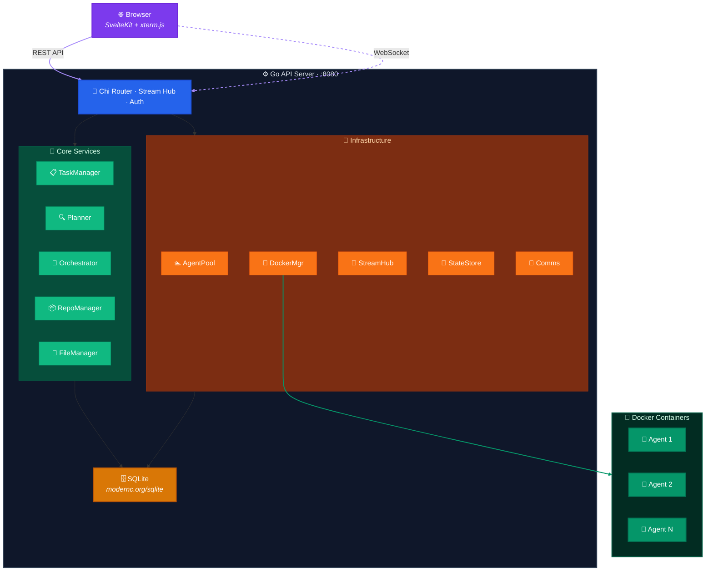
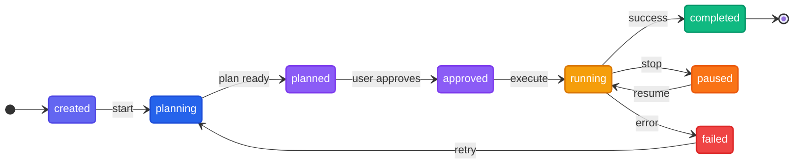

<p align="center">
  
</p>

<h3 align="center">AI Agent Orchestrator</h3>

<p align="center">
  Launch teams of Claude Code agents in Docker containers.<br/>
  Plan, execute, and deliver complex software tasks — with full visibility and control.
</p>

<p align="center">
  <a href="https://github.com/davidebaraldo/Klaudio/releases/latest"></a>
  <a href="https://github.com/davidebaraldo/Klaudio/actions/workflows/ci.yml"></a>
  <a href="LICENSE"></a>
  <a href="https://github.com/davidebaraldo/Klaudio/releases"></a>
  <a href="https://goreportcard.com/report/github.com/davidebaraldo/Klaudio"></a>
</p>

<p align="center">
  <a href="#-quick-start">Quick Start</a> &middot;
  <a href="ROADMAP.md">Roadmap</a> &middot;
  <a href="CONTRIBUTING.md">Contributing</a> &middot;
  <a href="RELEASES.md">Release Process</a> &middot;
  <a href="#-api-reference">API</a> &middot;
  <a href="https://github.com/davidebaraldo/Klaudio/releases">Releases</a>
</p>

---

## What is Klaudio?

Klaudio coordinates **multiple AI agents** working in parallel inside isolated Docker containers. Give it a task, and it:

1. **Plans** — A planner agent analyzes the task and produces a structured execution plan
2. **Asks** — The planner can ask clarification questions before committing to a plan
3. **Executes** — Agents are spawned based on the plan, working sequentially or collaboratively
4. **Delivers** — Results are collected, optionally reviewed, and can be auto-committed to Git

All with real-time streaming, a modern web UI, and full stop/resume capability.

---

## Highlights

| | Feature | Description |
|---|---------|-------------|
| **Planning** | Intelligent task decomposition | Read-only planner analyzes tasks, asks clarifying questions, generates structured plans with subtask dependencies |
| **Execution** | Two modes | **Sequential** (DAG-based) or **Collaborative** (manager + concurrent workers with directive-based coordination) |
| **Streaming** | Real-time visibility | Watch agent output live via WebSocket + xterm.js terminal, with backfill for late joiners |
| **Teams** | Multi-agent orchestration | Agents communicate through filesystem directives, database messages, and lifecycle signals |
| **State** | Stop & resume | Pause any task, save full state (files, Claude memory, conversation context), resume in a fresh container |
| **Git** | End-to-end integration | Clone repos, auto-commit, auto-push, and auto-create PRs on GitHub/Bitbucket |
| **Memory** | Repo memory | Optional per-template codebase analysis cached by commit — agents start with full context instead of re-analyzing from scratch |
| **UI** | Modern web interface | Dashboard, task detail (Plan, Agents, Comms, Files tabs), file viewer/editor, team templates |
| **Deploy** | Single binary | Frontend and Docker build context embedded in the Go binary — just download and run |

---

## Architecture



---

## Tech Stack

| Layer | Technology |
|-------|-----------|
| **Backend** | Go 1.22+, Chi v5 router, gorilla/websocket |
| **Database** | SQLite — pure Go driver, no CGO ([modernc.org/sqlite](https://pkg.go.dev/modernc.org/sqlite)) |
| **Containers** | Docker SDK for Go |
| **Frontend** | SvelteKit 2, Svelte 5, Tailwind CSS, xterm.js |
| **Git** | go-git v5, Bitbucket REST API v2 |
| **CI/CD** | GitHub Actions — multi-platform builds, Docker image publishing |

---

## Quick Start

### Option 1 — Download a release (recommended)

Download the latest binary from the [Releases page](https://github.com/davidebaraldo/Klaudio/releases/latest):

```bash
# Linux (amd64)
curl -L https://github.com/davidebaraldo/Klaudio/releases/latest/download/klaudio-linux-amd64 -o klaudio
chmod +x klaudio
./klaudio
```

The binary includes the web UI and Docker build context — no build step needed.

### Option 2 — Build from source

#### Prerequisites

- **Go 1.22+**
- **Docker Engine** running
- **Node.js 20+** (for the web UI)
- **Claude Code Max** account with config in `~/.claude/`

```bash
git clone https://github.com/davidebaraldo/Klaudio.git
cd Klaudio

# Build the agent Docker image
make docker-build

# Build everything (frontend + backend) and start
make run
```

The server starts at **http://localhost:8080** with the web UI served from the same port.

### Development mode

For faster iteration during development:

```bash
# Terminal 1: Build and run backend only
make dev

# Terminal 2: Start frontend dev server with HMR
cd web && npm install && npm run dev
```

The dev frontend runs at `http://localhost:5173` and proxies API calls to the Go backend.

---

## Task Lifecycle



### Execution Modes

**Sequential (DAG)** — Subtasks execute in dependency order. Each subtask waits for its dependencies to complete before starting.

**Collaborative** — A manager agent spawns first and writes coordination directives. Worker agents spawn simultaneously and wait for their directive files. The manager monitors progress and receives lifecycle signals (`WORKER_COMPLETED`, `WORKER_FAILED`, `ALL_WORKERS_DONE`).

---

## Configuration

Create a `config.yaml` file (or use environment variables):

```yaml
server:
  port: 8080                    # KLAUDIO_PORT
  host: 0.0.0.0                 # KLAUDIO_HOST

docker:
  image_name: klaudio-agent
  max_agents: 5                 # Global concurrent agent limit
  max_agents_per_task: 3        # Per-task agent limit

claude:
  auth_mode: host               # "host" (mount ~/.claude/) or "env" (session key)
  # session_key: ""             # CLAUDE_SESSION_KEY

database:
  path: data/klaudio.db         # KLAUDIO_DB_PATH

storage:
  data_dir: data
  auto_save_enabled: true
  auto_save_interval: 5m
  max_checkpoints: 3
```

### Claude Code Authentication

| Mode | How it works | Best for |
|------|-------------|----------|
| **host** (default) | Mounts `~/.claude/` into containers (read-only) | Local development |
| **env** | Pass `CLAUDE_SESSION_KEY` environment variable | CI/CD, servers |

---

## API Reference

### Tasks

| Method | Endpoint | Description |
|--------|----------|-------------|
| `POST` | `/api/tasks` | Create a new task |
| `GET` | `/api/tasks` | List tasks (paginated, filterable) |
| `GET` | `/api/tasks/:id` | Get task details with agents |
| `DELETE` | `/api/tasks/:id` | Delete a task |
| `POST` | `/api/tasks/:id/start` | Begin planning phase |
| `POST` | `/api/tasks/:id/approve` | Approve plan, start execution |
| `POST` | `/api/tasks/:id/stop` | Pause task, save checkpoint |
| `POST` | `/api/tasks/:id/resume` | Resume from checkpoint |
| `POST` | `/api/tasks/:id/relaunch` | Relaunch with same workspace |

### Plans & Questions

| Method | Endpoint | Description |
|--------|----------|-------------|
| `GET` | `/api/tasks/:id/plan` | Get execution plan |
| `GET` | `/api/tasks/:id/questions` | Get planner questions |
| `POST` | `/api/tasks/:id/questions/:qid/answer` | Answer a question |

### Communication & Files

| Method | Endpoint | Description |
|--------|----------|-------------|
| `POST` | `/api/tasks/:id/message` | Inject message to agent stdin |
| `GET/POST` | `/api/tasks/:id/messages` | Inter-agent messages |
| `GET/POST` | `/api/tasks/:id/files` | Upload/list task files |
| `WS` | `/ws/tasks/:id/stream` | Real-time agent output |

### Templates

| Method | Endpoint | Description |
|--------|----------|-------------|
| `GET/POST` | `/api/team-templates` | Team template CRUD |
| `GET/POST` | `/api/repo-templates` | Repository template CRUD |
| `GET` | `/api/repo-templates/:id/memory` | Get cached repo analysis |
| `DELETE` | `/api/repo-templates/:id/memory` | Clear cached repo analysis |

<details>
<summary><strong>Example: Create and start a task</strong></summary>

```bash
# Create a task with auto-start
curl -s http://localhost:8080/api/tasks \
  -H "Content-Type: application/json" \
  -d '{
    "name": "Hello World",
    "prompt": "Create a simple Hello World API in Go with tests",
    "auto_start": true
  }' | jq .

# Watch the task in your browser
open http://localhost:8080/tasks/<task-id>
```

</details>

---

## Project Structure

```
klaudio/
├── cmd/klaudio/              # Entry point, embed directives
├── internal/
│   ├── api/                  # HTTP handlers, Chi router, WebSocket
│   ├── agent/                # Agent pool management
│   ├── config/               # YAML + env configuration
│   ├── db/                   # SQLite layer (hand-written queries)
│   ├── docker/               # Docker container management
│   ├── embedded/             # Embedded frontend + Docker context
│   ├── files/                # File upload/download/transfer
│   ├── repo/                 # Git operations, repo analysis, platform APIs
│   ├── state/                # Checkpoint persistence, autosave
│   ├── stream/               # Real-time streaming hub
│   └── task/                 # Core orchestration engine
│       ├── manager.go            # Task lifecycle controller
│       ├── planner.go            # Read-only planner with Q&A
│       ├── orchestrator.go       # DAG-based sequential execution
│       ├── collaborative.go      # Manager + workers execution
│       ├── comms.go              # Inter-agent messaging
│       └── ...
├── docker/                   # Agent Dockerfile and entrypoint
├── migrations/               # SQL migrations (001–006)
├── web/                      # SvelteKit frontend
│   └── src/
│       ├── routes/               # Pages
│       └── lib/
│           ├── components/       # Terminal, PlanViewer, FileManager...
│           ├── stores/           # WebSocket, tasks
│           └── api.ts            # TypeScript API client
├── .github/workflows/        # CI + Release pipelines
├── config.yaml               # Default configuration
└── Makefile                  # Build targets
```

---

## Development

```bash
make build            # Build binary (frontend + backend)
make build-backend    # Build backend only (faster)
make run              # Build and start server
make dev              # Backend-only build + start
make docker-build     # Build agent Docker image
make test             # Run all tests
make clean            # Remove artifacts and database
make tidy             # go mod tidy
```

### Development Guidelines

- **No CGO** — Pure Go SQLite via `modernc.org/sqlite`
- **Context everywhere** — All I/O functions accept `context.Context`
- **Wrapped errors** — `fmt.Errorf("doing X: %w", err)`
- **Hand-written SQL** — No ORM, queries in `internal/db/queries.go`
- **Structured logging** — `log/slog` for all output
- **No global state** — Dependencies passed via structs

---

## Contributing

Contributions are welcome! See [CONTRIBUTING.md](CONTRIBUTING.md) for guidelines.

### Good first issues

- Add unit tests for existing packages
- Improve error messages and input validation
- UI improvements and bug fixes
- GitHub/GitLab Git integration ([Phase 7](ROADMAP.md#phase-7--multi-platform-git-integration-))

---

## License

[Apache License 2.0](LICENSE) — use it freely in personal and commercial projects.
