# Klaudio Roadmap

Development roadmap with current implementation status. Phases are listed in logical order, but **can be implemented in any order** based on priority and needs.

```mermaid
graph LR
    P1["🏗️ Phase 1<br/><b>Foundation & Docker</b><br/>✅ Complete"]
    P2["⚙️ Phase 2<br/><b>Task Engine</b><br/>✅ Complete"]
    P3["📡 Phase 3<br/><b>Streaming & Web UI</b><br/>✅ Complete"]
    P4["🔀 Phase 4<br/><b>Repo & Git</b><br/>✅ Complete"]
    P5["⏸️ Phase 5<br/><b>Stop/Resume</b><br/>✅ Complete"]
    P6["👥 Phase 6<br/><b>Team Agents</b><br/>✅ Complete"]
    P6P["🤝 Phase 6+<br/><b>Collaborative + Comms</b><br/>✅ Complete"]
    P7["🌍 Phase 7<br/><b>Multi-Platform Git</b><br/>⬜ Planned"]
    P8["🖥️ Phase 8<br/><b>Service Installation</b><br/>⬜ Planned"]
    P9["🚀 Phase 9<br/><b>CI/CD & Releases</b><br/>⬜ Planned"]

    P1 -.- P2 -.- P3 -.- P4 -.- P5 -.- P6 -.- P6P -.- P7 -.- P8 -.- P9

    style P1 fill:#059669,stroke:#047857,color:#fff,stroke-width:2px
    style P2 fill:#0d9488,stroke:#0f766e,color:#fff,stroke-width:2px
    style P3 fill:#2563eb,stroke:#1d4ed8,color:#fff,stroke-width:2px
    style P4 fill:#7c3aed,stroke:#6d28d9,color:#fff,stroke-width:2px
    style P5 fill:#8b5cf6,stroke:#7c3aed,color:#fff,stroke-width:2px
    style P6 fill:#d946ef,stroke:#c026d3,color:#fff,stroke-width:2px
    style P6P fill:#ec4899,stroke:#db2777,color:#fff,stroke-width:2px
    style P7 fill:#475569,stroke:#64748b,color:#e2e8f0,stroke-width:2px,stroke-dasharray:5
    style P8 fill:#475569,stroke:#64748b,color:#e2e8f0,stroke-width:2px,stroke-dasharray:5
    style P9 fill:#475569,stroke:#64748b,color:#e2e8f0,stroke-width:2px,stroke-dasharray:5

    linkStyle 0 stroke:#10b981,stroke-width:2px,stroke-dasharray:5
    linkStyle 1 stroke:#14b8a6,stroke-width:2px,stroke-dasharray:5
    linkStyle 2 stroke:#3b82f6,stroke-width:2px,stroke-dasharray:5
    linkStyle 3 stroke:#8b5cf6,stroke-width:2px,stroke-dasharray:5
    linkStyle 4 stroke:#a855f7,stroke-width:2px,stroke-dasharray:5
    linkStyle 5 stroke:#e879f9,stroke-width:2px,stroke-dasharray:5
    linkStyle 6 stroke:#64748b,stroke-width:2px,stroke-dasharray:5
    linkStyle 7 stroke:#64748b,stroke-width:2px,stroke-dasharray:5
    linkStyle 8 stroke:#64748b,stroke-width:2px,stroke-dasharray:5
```

---

## Phase 1 — Foundation & Docker ✅

Go backend that launches Claude Code containers and captures output.

| # | Feature | Status |
|---|---------|--------|
| 1.1 | Go project setup with Makefile | ✅ Done |
| 1.2 | Agent Docker image (Node.js + Claude Code CLI) | ✅ Done |
| 1.3 | Docker Manager — build, create, start, stop, remove, attach containers | ✅ Done |
| 1.4 | Config system — YAML file + environment variable overrides | ✅ Done |
| 1.5 | Claude Code auth — host mount or session key env var | ✅ Done |
| 1.6 | HTTP server — Chi v5 router, health check, CORS | ✅ Done |
| 1.7 | SQLite database — schema, migrations (modernc.org/sqlite, no CGO) | ✅ Done |
| 1.8 | Task API — create task, launch container, return output | ✅ Done |
| 1.9 | E2E test script | ⬜ To do |
| 1.10 | Auto Docker image build — rebuild agent image on `make build` / server start if image is missing or `docker/` files have changed | ⬜ To do |
| 1.11 | Embedded Docker image — embed `Dockerfile` and build context in the Go binary via `//go:embed`, load image from binary at runtime if not present on host | ⬜ To do |

**Key files**: `cmd/klaudio/main.go`, `internal/config/`, `internal/docker/`, `internal/api/router.go`, `internal/db/`, `docker/Dockerfile.agent`

---

## Phase 2 — Task Engine & Planning ✅

Planner agent analyzes tasks, produces structured plans, user approves before execution.

| # | Feature | Status |
|---|---------|--------|
| 2.1 | Task state machine (created → planning → planned → approved → running → completed/failed) | ✅ Done |
| 2.2 | Planner agent — read-only analysis, generates JSON execution plan | ✅ Done |
| 2.3 | Planner Q&A — planner can ask clarification questions, user answers from UI | ✅ Done |
| 2.4 | ExecutionPlan model — subtasks with dependencies, complexity, involved files | ✅ Done |
| 2.5 | Plan output parsing — extract JSON from stream-json, markdown fallback | ✅ Done |
| 2.6 | Plan API — get, update, approve, replan | ✅ Done |
| 2.7 | Sequential task executor | ✅ Done |
| 2.8 | Event system — audit log for all state changes | ✅ Done |
| 2.9 | File upload (multipart) and download | ✅ Done |
| 2.10 | Container file transfer via Docker API | ✅ Done |

**Key files**: `internal/task/manager.go`, `internal/task/planner.go`, `internal/task/plan.go`, `internal/task/executor.go`, `internal/api/plans.go`, `internal/api/files.go`

---

## Phase 3 — Real-time Streaming & Web UI ✅

Agent output visible live in the browser. Full web interface.

| # | Feature | Status |
|---|---------|--------|
| 3.1 | Stream Hub — ring buffer per container, fan-out to WebSocket clients | ✅ Done |
| 3.2 | Docker attach streaming — pipe stdout/stderr to StreamHub | ✅ Done |
| 3.3 | WebSocket endpoint with backfill for late joiners | ✅ Done |
| 3.4 | Message injection — user sends message → container stdin | ✅ Done |
| 3.5 | SvelteKit 2 + Svelte 5 + Tailwind CSS project | ✅ Done |
| 3.6 | Layout — sidebar, header, routing | ✅ Done |
| 3.7 | Dashboard — task list with status badges, filters | ✅ Done |
| 3.8 | Task detail — tabs: Plan, Agents, Comms, Files | ✅ Done |
| 3.9 | Terminal — xterm.js with live WebSocket data | ✅ Done |
| 3.10 | Message injection UI — input box below terminal | ✅ Done |
| 3.11 | Plan viewer/editor — structured view with inline edit | ✅ Done |
| 3.12 | File manager — upload, download, nested file tree | ✅ Done |
| 3.13 | Task creation wizard — multi-step form | ✅ Done |
| 3.14 | WebSocket store — reactive Svelte store for WS connection | ✅ Done |
| 3.15 | Dev server proxy — Vite proxy to Go backend | ✅ Done |
| 3.16 | File content viewer — view, edit, delete files via modal | ✅ Done |
| 3.17 | Embedded frontend — `npm run build` + `//go:embed` to bundle SvelteKit static assets into the Go binary | ⬜ To do |
| 3.18 | Static file server — serve embedded frontend on `/` with SPA fallback, coexisting with `/api` routes | ⬜ To do |
| 3.19 | Build integration — `make build` runs frontend build before Go compile, single binary output | ⬜ To do |

**Key files**: `internal/stream/`, `internal/api/websocket.go`, `web/src/routes/`, `web/src/lib/components/`, `web/src/lib/api.ts`

---

## Phase 4 — Repository & Git Integration ✅

Tasks operate on Git repositories with auto-commit, push, and PR creation.

| # | Feature | Status |
|---|---------|--------|
| 4.1 | RepoManager — clone, branch, commit, push via go-git | ✅ Done |
| 4.2 | Git credential injection — token → credential helper in container | ✅ Done |
| 4.3 | Bitbucket API client — create PR, list branches, get repo info | ✅ Done |
| 4.4 | Repo config model — URL, branch, token, auto-PR settings (with `platform` field prepared) | ✅ Done |
| 4.5 | Container repo setup — clone into workspace before agent launch | ✅ Done |
| 4.6 | Auto-commit — detect changes post-execution, commit if configured | ✅ Done |
| 4.7 | Auto-PR — branch → commit → push → create PR via Bitbucket API | ✅ Done |
| 4.8 | Repo templates — saveable, reusable repo configurations | ✅ Done |
| 4.9 | UI: repo config form with granular permissions and per-task overrides | ✅ Done |
| 4.10 | UI: PR link display in task detail | ✅ Done |
| 4.11 | CLAUDE.md injection — repo's CLAUDE.md used by agent automatically | ✅ Done |

**Key files**: `internal/repo/manager.go`, `internal/repo/git.go`, `internal/repo/bitbucket.go`, `internal/repo/postexec.go`

---

## Phase 5 — Stop/Resume & State Management ✅

Any task can be paused and resumed with full state preservation.

| # | Feature | Status |
|---|---------|--------|
| 5.1 | State directory structure (`data/states/{taskID}/`) | ✅ Done |
| 5.2 | Checkpoint save — workspace + Claude memory + agent logs + metadata | ✅ Done |
| 5.3 | Graceful stop — SIGTERM → wait for memory save → SIGKILL timeout | ✅ Done |
| 5.4 | Checkpoint restore — mount state in new container, inject resume prompt | ✅ Done |
| 5.5 | Resume prompt — reconstructs full context for Claude Code | ✅ Done |
| 5.6 | Claude memory persistence — copy .claude/ in/out of containers | ✅ Done |
| 5.7 | Conversation context save | ✅ Done |
| 5.8 | Partial progress tracking — skip completed subtasks on resume | ✅ Done |
| 5.9 | UI: stop/resume buttons with state feedback | ✅ Done |
| 5.10 | UI: saved state indicator with timestamp | ✅ Done |
| 5.11 | Periodic auto-save (configurable interval, default 5 min) | ✅ Done |
| 5.12 | State cleanup — garbage collection of old checkpoints | ✅ Done |

**Key files**: `internal/state/store.go`, `internal/state/checkpoint.go`, `internal/state/autosave.go`

---

## Phase 6 — Agent Teams & Orchestration ✅

Multiple agents work in parallel, coordinated by dependency graph.

| # | Feature | Status |
|---|---------|--------|
| 6.1 | Agent Pool — container pool with configurable limits | ✅ Done |
| 6.2 | Subtask assignment — assign subtasks to agents from plan | ✅ Done |
| 6.3 | Dependency resolver — DAG, cycle detection, topological sort | ✅ Done |
| 6.4 | Shared workspace — shared Docker volume between task agents | ✅ Done |
| 6.5 | Agent-to-agent context — pass output + modified files to dependents | ✅ Done |
| 6.6 | Reviewer agent — optional final QA verification | ✅ Done |
| 6.7 | Conflict resolution — detect and resolve file conflicts between agents | ✅ Done |
| 6.8 | Concurrency limits — global and per-task configurable max agents | ✅ Done |
| 6.9 | UI: agent grid view — terminal for each agent | ⬜ To do |
| 6.10 | UI: dependency graph visualization | ⬜ To do |
| 6.11 | UI: per-agent message injection | ⬜ To do |
| 6.12 | Team templates — predefined team configurations | ✅ Done |
| 6.13 | File-level locking — prevent concurrent modification | ✅ Done |

**Key files**: `internal/agent/pool.go`, `internal/task/orchestrator.go`, `internal/task/dependency.go`, `internal/task/reviewer.go`, `internal/task/filelock.go`

---

## Phase 6+ — Collaborative Mode & Inter-Agent Communication ✅

New execution mode with manager-directed coordination and full inter-agent messaging.

| # | Feature | Status |
|---|---------|--------|
| 6+.1 | Collaborative execution mode — manager + concurrent workers | ✅ Done |
| 6+.2 | Manager agent — spawns first, writes directives, monitors workers | ✅ Done |
| 6+.3 | Worker directive wait — workers loop waiting for directive file | ✅ Done |
| 6+.4 | Lifecycle signals — WORKER_COMPLETED, WORKER_FAILED, ALL_WORKERS_DONE | ✅ Done |
| 6+.5 | Inter-agent messaging API — POST/GET /api/tasks/:id/messages | ✅ Done |
| 6+.6 | Agent messages DB — `agent_messages` table (message, context, summary, directive) | ✅ Done |
| 6+.7 | Context passing via filesystem — `.klaudio/context/{subtaskID}.md` | ✅ Done |
| 6+.8 | Manager directives via filesystem — `.klaudio/directives/` | ✅ Done |
| 6+.9 | Team template modes — `sequential` vs `collaborative` | ✅ Done |
| 6+.10 | Team template CRUD API | ✅ Done |
| 6+.11 | Role-based prompt hints — custom instructions per role | ✅ Done |
| 6+.12 | File content management — view/edit/delete via `/file-viewer` | ✅ Done |
| 6+.13 | UI: Comms tab — inter-agent communication visualization | ✅ Done |
| 6+.14 | UI: File viewer modal — Copy, Edit, Delete, Download | ✅ Done |
| 6+.15 | UI: Collapsible .klaudio section in file manager | ✅ Done |

**Key files**: `internal/task/collaborative.go`, `internal/task/comms.go`, `internal/api/teams.go`, `web/src/lib/components/AgentComms.svelte`

---

## Phase 7 — Multi-Platform Git Integration ⬜

**Status**: PLANNED

Extend repository support to GitHub and GitLab with unified platform abstraction.

| # | Feature | Status |
|---|---------|--------|
| 7.1 | `GitPlatform` interface — common abstraction for PR, branches, repo info | ⬜ To do |
| 7.2 | GitHub API client — create PR, list branches, manage reviewers, labels | ⬜ To do |
| 7.3 | GitLab API client — create merge request, list branches, manage pipelines | ⬜ To do |
| 7.4 | Platform auto-detection — parse URL to detect github.com, gitlab.com, bitbucket.org | ⬜ To do |
| 7.5 | Unified credential management — PAT, OAuth, SSH per platform | ⬜ To do |
| 7.6 | GitHub Actions integration — trigger/monitor CI after PR | ⬜ To do |
| 7.7 | GitLab CI integration — trigger/monitor pipelines after MR | ⬜ To do |
| 7.8 | Self-hosted support — GitHub Enterprise, GitLab self-managed | ⬜ To do |
| 7.9 | PR/MR status tracking — poll status, display checks/reviews in UI | ⬜ To do |
| 7.10 | Multi-repo tasks — single task across multiple repositories | ⬜ To do |
| 7.11 | UI: platform selector in repo config | ⬜ To do |
| 7.12 | UI: PR/MR status widget with CI results | ⬜ To do |
| 7.13 | Repo template platform field | ⬜ To do |

---

## Phase 8 — Service Installation (Windows & Linux) ⬜

**Status**: PLANNED

Install and run Klaudio as a native OS service with automatic startup, logging, and management.

| # | Feature | Status |
|---|---------|--------|
| 8.1 | Windows Service wrapper — register Klaudio as a Windows Service via `sc.exe` or Go `golang.org/x/sys/windows/svc` | ⬜ To do |
| 8.2 | Windows installer — MSI or NSIS installer with service registration, config, and uninstall | ⬜ To do |
| 8.3 | Windows Event Log integration — structured logging to Windows Event Log | ⬜ To do |
| 8.4 | Windows tray icon — optional system tray icon with status and quick actions | ⬜ To do |
| 8.5 | Linux systemd unit — `klaudio.service` unit file with proper dependencies (docker.service) | ⬜ To do |
| 8.6 | Linux install script — `install.sh` for automated setup (binary, config, systemd unit, user/group) | ⬜ To do |
| 8.7 | Linux journald integration — structured logging via systemd journal | ⬜ To do |
| 8.8 | Service CLI commands — `klaudio install`, `klaudio uninstall`, `klaudio start`, `klaudio stop`, `klaudio status` | ⬜ To do |
| 8.9 | Cross-platform service abstraction — unified interface for Windows SCM and Linux systemd | ⬜ To do |
| 8.10 | Auto-restart and watchdog — automatic recovery on crash, systemd `WatchdogSec` / Windows recovery options | ⬜ To do |
| 8.11 | Config file paths — platform-appropriate defaults (`/etc/klaudio/` on Linux, `%ProgramData%\Klaudio\` on Windows) | ⬜ To do |
| 8.12 | Log rotation — logrotate config (Linux) and log size limits (Windows) | ⬜ To do |
| 8.13 | Docker dependency check — verify Docker Engine is running before service start | ⬜ To do |
| 8.14 | Graceful shutdown — clean container teardown on service stop signal | ⬜ To do |

---

## Phase 9 — CI/CD & GitHub Actions Releases ⬜

**Status**: PLANNED

Automated build, test, and release pipeline via GitHub Actions with multi-platform binaries and Docker images.

| # | Feature | Status |
|---|---------|--------|
| 9.1 | CI workflow — `ci.yml`: lint, test, build on every push and PR (Go + Node.js matrix) | ⬜ To do |
| 9.2 | Release workflow — `release.yml`: triggered by `v*` tags, builds release artifacts | ⬜ To do |
| 9.3 | Multi-platform Go binaries — cross-compile for `linux/amd64`, `linux/arm64`, `darwin/amd64`, `darwin/arm64`, `windows/amd64` | ⬜ To do |
| 9.4 | Frontend build — bundle SvelteKit static assets, embed in Go binary or ship as separate archive | ⬜ To do |
| 9.5 | Docker image publish — build and push `klaudio-agent` image to GitHub Container Registry (ghcr.io) | ⬜ To do |
| 9.6 | GitHub Release — auto-create release with changelog, checksums (SHA256), and signed artifacts | ⬜ To do |
| 9.7 | GoReleaser integration — `.goreleaser.yml` for automated multi-platform builds, archives, and changelogs | ⬜ To do |
| 9.8 | Semantic versioning — version injected at build time via `ldflags` (`-X main.version=`) | ⬜ To do |
| 9.9 | Changelog generation — auto-generate from conventional commits (`feat:`, `fix:`, `refactor:`) | ⬜ To do |
| 9.10 | Security scanning — CodeQL analysis, dependency vulnerability check (Dependabot / `govulncheck`) | ⬜ To do |
| 9.11 | Docker multi-arch — build agent image for `linux/amd64` and `linux/arm64` via `docker buildx` | ⬜ To do |
| 9.12 | Release installers — include Windows MSI and Linux `.deb`/`.rpm` packages in release assets | ⬜ To do |
| 9.13 | Pre-release workflow — publish beta/rc releases from feature branches | ⬜ To do |
| 9.14 | Auto-update check — `klaudio update` command checks GitHub Releases API for newer versions | ⬜ To do |
| 9.15 | Self-update — download and replace binary in-place, restart service if running as service | ⬜ To do |
| 9.16 | Update notification — show banner in Web UI and CLI when a new version is available | ⬜ To do |
| 9.17 | Update channel — configurable `stable` / `beta` channel for release selection | ⬜ To do |
| 9.18 | Release notification — post to GitHub Discussions or Slack on new release | ⬜ To do |

---

## Future Ideas

Features being considered for future phases:

- **Authentication & multi-user** — User accounts, API keys, role-based access
- **Agent marketplace** — Custom agent types with specialized capabilities
- **Webhook triggers** — Start tasks from GitHub/GitLab/Bitbucket webhooks
- **Task templates** — Reusable task configurations for common operations
- **Cost tracking** — Track token usage and compute costs per task
- **Notifications** — Email/Slack alerts on task completion/failure
- **Plugin system** — Extensible architecture for custom integrations
- **Kubernetes support** — Run agents on K8s instead of Docker
- **Multi-model support** — Support for other AI coding assistants beyond Claude Code

---

## Summary

| Phase | Name | Status | Lines | Files |
|-------|------|--------|-------|-------|
| 1 | Foundation & Docker | ✅ | ~1,500 | 15 |
| 2 | Task Engine & Planning | ✅ | ~2,500 | 10 |
| 3 | Streaming & Web UI | ✅ | ~3,000 | 30+ |
| 4 | Repo & Git | ✅ | ~450 | 4 |
| 5 | Stop/Resume | ✅ | ~400 | 3 |
| 6 | Team Agents | ✅ | ~1,500 | 6 |
| 6+ | Collaborative + Comms | ✅ | ~1,100 | 5 |
| 7 | Multi-Platform Git | ⬜ | — | — |
| 8 | Service Installation | ⬜ | — | — |
| 9 | CI/CD & Releases | ⬜ | — | — |
| **Total** | | | **~15,000** | **~75** |
