# Roadmap

Development roadmap with implementation status. Phases are listed in logical order, but **can be implemented in any order** based on priority and community interest.

> **Legend**: ✅ Done &middot; ⬜ Planned

```mermaid
graph LR
    P1["🏗️ Phase 1<br/><b>Foundation & Docker</b><br/>✅ Complete"]
    P2["⚙️ Phase 2<br/><b>Task Engine</b><br/>✅ Complete"]
    P3["📡 Phase 3<br/><b>Streaming & Web UI</b><br/>✅ Complete"]
    P4["🔀 Phase 4<br/><b>Repo & Git</b><br/>✅ Complete"]
    P5["⏸️ Phase 5<br/><b>Stop/Resume</b><br/>✅ Complete"]
    P6["👥 Phase 6<br/><b>Team Agents</b><br/>✅ Complete"]
    P6P["🤝 Phase 6+<br/><b>Collaborative + Comms</b><br/>✅ Complete"]
    P7["🌍 Phase 7<br/><b>Multi-Platform Git</b><br/>🔶 Partial"]
    P8["🖥️ Phase 8<br/><b>Service Installation</b><br/>⬜ Planned"]
    P9["🚀 Phase 9<br/><b>CI/CD & Releases</b><br/>⬜ Planned"]

    P1 -.- P2 -.- P3 -.- P4 -.- P5 -.- P6 -.- P6P -.- P7 -.- P8 -.- P9

    style P1 fill:#059669,stroke:#047857,color:#fff,stroke-width:2px
    style P2 fill:#0d9488,stroke:#0f766e,color:#fff,stroke-width:2px
    style P3 fill:#2563eb,stroke:#1d4ed8,color:#fff,stroke-width:2px
    style P4 fill:#7c3aed,stroke:#6d28d9,color:#fff,stroke-width:2px
    style P5 fill:#8b5cf6,stroke:#7c3aed,color:#fff,stroke-width:2px
    style P6 fill:#d946ef,stroke:#c026d3,color:#fff,stroke-width:2px
    style P6P fill:#ec4899,stroke:#db2777,color:#fff,stroke-width:2px
    style P7 fill:#d97706,stroke:#b45309,color:#fff,stroke-width:2px
    style P8 fill:#475569,stroke:#64748b,color:#e2e8f0,stroke-width:2px,stroke-dasharray:5
    style P9 fill:#475569,stroke:#64748b,color:#e2e8f0,stroke-width:2px,stroke-dasharray:5

    linkStyle 0 stroke:#10b981,stroke-width:2px,stroke-dasharray:5
    linkStyle 1 stroke:#14b8a6,stroke-width:2px,stroke-dasharray:5
    linkStyle 2 stroke:#3b82f6,stroke-width:2px,stroke-dasharray:5
    linkStyle 3 stroke:#8b5cf6,stroke-width:2px,stroke-dasharray:5
    linkStyle 4 stroke:#a855f7,stroke-width:2px,stroke-dasharray:5
    linkStyle 5 stroke:#e879f9,stroke-width:2px,stroke-dasharray:5
    linkStyle 6 stroke:#64748b,stroke-width:2px,stroke-dasharray:5
    linkStyle 7 stroke:#64748b,stroke-width:2px,stroke-dasharray:5
    linkStyle 8 stroke:#64748b,stroke-width:2px,stroke-dasharray:5
```

---

## Phase 1 — Foundation & Docker ✅

Go backend that launches Claude Code containers and captures output.

| # | Feature | Status |
|---|---------|--------|
| 1.1 | Go project with Makefile | ✅ |
| 1.2 | Agent Docker image (Node.js + Claude Code CLI) | ✅ |
| 1.3 | Docker Manager — build, create, start, stop, remove, attach | ✅ |
| 1.4 | Config system — YAML + environment variable overrides | ✅ |
| 1.5 | Claude Code auth — host mount or session key | ✅ |
| 1.6 | HTTP server — Chi v5, health check, CORS | ✅ |
| 1.7 | SQLite database — schema, migrations (pure Go, no CGO) | ✅ |
| 1.8 | Task API — create, launch, return output | ✅ |
| 1.9 | E2E test script | ⬜ |
| 1.10 | Auto Docker image build on server start | ✅ |
| 1.11 | Embedded Docker context in Go binary via `//go:embed` | ✅ |

---

## Phase 2 — Task Engine & Planning ✅

Planner agent analyzes tasks, produces structured plans, user approves before execution.

| # | Feature | Status |
|---|---------|--------|
| 2.1 | Task state machine (created → planning → planned → approved → running → completed/failed) | ✅ |
| 2.2 | Planner agent — read-only analysis, JSON execution plan | ✅ |
| 2.3 | Planner Q&A — clarification questions, user answers from UI | ✅ |
| 2.4 | ExecutionPlan model — subtasks with dependencies | ✅ |
| 2.5 | Plan output parsing — JSON from stream, markdown fallback | ✅ |
| 2.6 | Plan API — get, update, approve, replan | ✅ |
| 2.7 | Sequential task executor | ✅ |
| 2.8 | Event system — audit log for state changes | ✅ |
| 2.9 | File upload (multipart) and download | ✅ |
| 2.10 | Container file transfer via Docker API | ✅ |

---

## Phase 3 — Streaming & Web UI ✅

Agent output visible live in the browser. Full web interface.

| # | Feature | Status |
|---|---------|--------|
| 3.1 | Stream Hub — ring buffer, fan-out to WebSocket clients | ✅ |
| 3.2 | Docker attach streaming to StreamHub | ✅ |
| 3.3 | WebSocket endpoint with backfill | ✅ |
| 3.4 | Message injection — user → container stdin | ✅ |
| 3.5 | SvelteKit 2 + Svelte 5 + Tailwind CSS | ✅ |
| 3.6 | Layout — sidebar, header, routing | ✅ |
| 3.7 | Dashboard — task list, status badges, filters | ✅ |
| 3.8 | Task detail — tabs: Plan, Agents, Comms, Files | ✅ |
| 3.9 | Terminal — xterm.js with live WebSocket | ✅ |
| 3.10 | Message injection UI | ✅ |
| 3.11 | Plan viewer/editor | ✅ |
| 3.12 | File manager — upload, download, nested tree | ✅ |
| 3.13 | Task creation wizard | ✅ |
| 3.14 | WebSocket reactive Svelte store | ✅ |
| 3.15 | Vite dev server proxy | ✅ |
| 3.16 | File content viewer — view, edit, delete | ✅ |
| 3.17 | Embedded frontend via `//go:embed` | ✅ |
| 3.18 | Static file server with SPA fallback | ✅ |
| 3.19 | Single binary output (`make build`) | ✅ |

---

## Phase 4 — Repository & Git ✅

Tasks operate on Git repositories with auto-commit, push, and PR creation.

| # | Feature | Status |
|---|---------|--------|
| 4.1 | RepoManager — clone, branch, commit, push (go-git) | ✅ |
| 4.2 | Git credential injection | ✅ |
| 4.3 | Bitbucket API client — PR creation, branch listing | ✅ |
| 4.4 | Repo config model — URL, branch, token, auto-PR | ✅ |
| 4.5 | Container repo setup — clone into workspace | ✅ |
| 4.6 | Auto-commit on task completion | ✅ |
| 4.7 | Auto-PR — branch → commit → push → PR | ✅ |
| 4.8 | Repo templates — saveable configurations | ✅ |
| 4.9 | UI: repo config form with per-task overrides | ✅ |
| 4.10 | UI: PR link display | ✅ |
| 4.11 | CLAUDE.md injection into agent containers | ✅ |
| 4.12 | Repo memory — cached codebase analysis per template/branch/commit | ✅ |
| 4.13 | Static analyzer — languages, frameworks, dependencies, file tree | ✅ |
| 4.14 | Repo memory injection into planner and agent prompts | ✅ |
| 4.15 | Repo memory API — GET/DELETE per template | ✅ |
| 4.16 | UI: enable_memory toggle on repo templates | ✅ |

---

## Phase 5 — Stop/Resume ✅

Pause and resume any task with full state preservation.

| # | Feature | Status |
|---|---------|--------|
| 5.1 | State directory structure | ✅ |
| 5.2 | Checkpoint save — workspace, Claude memory, logs, metadata | ✅ |
| 5.3 | Graceful stop — SIGTERM → wait → SIGKILL | ✅ |
| 5.4 | Checkpoint restore in new container | ✅ |
| 5.5 | Resume prompt — full context reconstruction | ✅ |
| 5.6 | Claude memory persistence | ✅ |
| 5.7 | Conversation context save | ✅ |
| 5.8 | Partial progress tracking — skip completed subtasks | ✅ |
| 5.9 | UI: stop/resume buttons | ✅ |
| 5.10 | UI: saved state indicator | ✅ |
| 5.11 | Periodic auto-save (configurable, default 5m) | ✅ |
| 5.12 | State cleanup — garbage collection | ✅ |

---

## Phase 6 — Agent Teams ✅

Multiple agents work in parallel, coordinated by dependency graph.

| # | Feature | Status |
|---|---------|--------|
| 6.1 | Agent Pool — container pool with limits | ✅ |
| 6.2 | Subtask assignment from plan | ✅ |
| 6.3 | Dependency resolver — DAG, cycle detection, topo sort | ✅ |
| 6.4 | Shared workspace — shared Docker volume | ✅ |
| 6.5 | Agent-to-agent context — output + files to dependents | ✅ |
| 6.6 | Reviewer agent — optional QA verification | ✅ |
| 6.7 | Conflict resolution — detect and resolve file conflicts | ✅ |
| 6.8 | Concurrency limits — global and per-task | ✅ |
| 6.9 | UI: agent grid view | ✅ |
| 6.10 | UI: dependency graph visualization | ✅ |
| 6.11 | UI: per-agent message injection | ✅ |
| 6.12 | Team templates — predefined configurations | ✅ |
| 6.13 | File-level locking | ✅ |

---

## Phase 6+ — Collaborative Mode ✅

Manager-directed coordination with inter-agent messaging.

| # | Feature | Status |
|---|---------|--------|
| 6+.1 | Collaborative mode — manager + concurrent workers | ✅ |
| 6+.2 | Manager agent — directives, monitoring | ✅ |
| 6+.3 | Worker directive wait — loop until directive file appears | ✅ |
| 6+.4 | Lifecycle signals — WORKER_COMPLETED, WORKER_FAILED, ALL_WORKERS_DONE | ✅ |
| 6+.5 | Inter-agent messaging API | ✅ |
| 6+.6 | Agent messages DB table | ✅ |
| 6+.7 | Context passing via filesystem | ✅ |
| 6+.8 | Manager directives via `.klaudio/directives/` | ✅ |
| 6+.9 | Team template modes — sequential vs collaborative | ✅ |
| 6+.10 | Team template CRUD API | ✅ |
| 6+.11 | Role-based prompt hints | ✅ |
| 6+.12 | File content management — view/edit/delete | ✅ |
| 6+.13 | UI: Comms tab | ✅ |
| 6+.14 | UI: File viewer modal | ✅ |
| 6+.15 | UI: Collapsible .klaudio section | ✅ |

---

## Phase 7 — Multi-Platform Git 🔶

> GitHub and GitLab integration with unified platform abstraction.

| # | Feature | Status |
|---|---------|--------|
| 7.1 | Platform auto-detection from URL | ✅ |
| 7.2 | GitHub API client — PRs, branches, reviewers | ✅ |
| 7.3 | Platform-aware Git auth (x-access-token / x-token-auth) | ✅ |
| 7.4 | GitHub URL parsing (HTTPS + SSH) | ✅ |
| 7.5 | Auto-PR support for GitHub + Bitbucket | ✅ |
| 7.6 | GitLab API client — MRs, branches, pipelines | ⬜ |
| 7.7 | Unified credential management (PAT, OAuth, SSH) | ⬜ |
| 7.8 | GitHub Actions integration | ⬜ |
| 7.9 | GitLab CI integration | ⬜ |
| 7.10 | Self-hosted support (GHE, GitLab self-managed) | ⬜ |
| 7.11 | PR/MR status tracking with CI results | ⬜ |
| 7.12 | Multi-repo tasks | ⬜ |
| 7.13 | UI: platform selector | ⬜ |
| 7.14 | UI: PR/MR status widget | ⬜ |

---

## Phase 8 — Service Installation ⬜

> Run Klaudio as a native OS service with auto-start and management.

| # | Feature | Status |
|---|---------|--------|
| 8.1 | Windows Service via `golang.org/x/sys/windows/svc` | ⬜ |
| 8.2 | Windows installer (MSI/NSIS) | ⬜ |
| 8.3 | Windows Event Log integration | ⬜ |
| 8.4 | System tray icon (optional) | ⬜ |
| 8.5 | Linux systemd unit file | ⬜ |
| 8.6 | Linux install script | ⬜ |
| 8.7 | journald logging integration | ⬜ |
| 8.8 | CLI: `klaudio install/uninstall/start/stop/status` | ⬜ |
| 8.9 | Cross-platform service abstraction | ⬜ |
| 8.10 | Auto-restart and watchdog | ⬜ |
| 8.11 | Platform-appropriate config paths | ⬜ |
| 8.12 | Log rotation | ⬜ |
| 8.13 | Docker dependency check on start | ⬜ |
| 8.14 | Graceful shutdown on service stop | ⬜ |

---

## Phase 9 — CI/CD & Releases ⬜

> Automated build, test, and release pipeline.

| # | Feature | Status |
|---|---------|--------|
| 9.1 | CI workflow (`ci.yml`) | ✅ |
| 9.2 | Release workflow (`release.yml`, triggered by `v*` tags) | ✅ |
| 9.3 | Multi-platform Go binaries (5 targets) | ✅ |
| 9.4 | Frontend bundled in release binaries | ✅ |
| 9.5 | Docker image published to ghcr.io | ✅ |
| 9.6 | GitHub Release with checksums | ✅ |
| 9.7 | GoReleaser integration | ⬜ |
| 9.8 | Semantic versioning via ldflags | ⬜ |
| 9.9 | Changelog from conventional commits | ⬜ |
| 9.10 | Security scanning (CodeQL, govulncheck) | ⬜ |
| 9.11 | Docker multi-arch (amd64 + arm64) | ⬜ |
| 9.12 | Release installers (.deb, .rpm, .msi) | ⬜ |
| 9.13 | Pre-release workflow (beta/rc) | ⬜ |
| 9.14 | `klaudio update` — check for new versions | ⬜ |
| 9.15 | Self-update — download and replace binary | ⬜ |
| 9.16 | Update notification in Web UI | ⬜ |
| 9.17 | Update channels (stable/beta) | ⬜ |
| 9.18 | Release notification (Discussions/Slack) | ⬜ |

---

## Future Ideas

- **Authentication & multi-user** — accounts, API keys, RBAC
- **Agent marketplace** — custom agent types with specialized capabilities
- **Webhook triggers** — start tasks from GitHub/GitLab/Bitbucket events
- **Task templates** — reusable configurations for common operations
- **Cost tracking** — token usage and compute costs per task
- **Notifications** — email/Slack alerts on completion/failure
- **Plugin system** — extensible architecture for integrations
- **Kubernetes support** — run agents on K8s instead of Docker
- **Multi-model support** — other AI coding assistants beyond Claude Code

---

## Summary

| Phase | Status | Description |
|-------|--------|-------------|
| 1. Foundation & Docker | ✅ | Go backend, Docker containers, config, database |
| 2. Task Engine | ✅ | Planning, state machine, execution |
| 3. Streaming & UI | ✅ | WebSocket, xterm.js, SvelteKit dashboard |
| 4. Repo & Git | ✅ | Clone, commit, push, auto-PR |
| 5. Stop/Resume | ✅ | Checkpoints, auto-save, state restore |
| 6. Team Agents | ✅ | Agent pool, DAG execution, file locking |
| 6+. Collaborative | ✅ | Manager/workers, directives, messaging |
| 7. Multi-Platform Git | 🔶 | GitHub + Bitbucket auto-PR, GitLab planned |
| 8. Service Install | ⬜ | Windows/Linux service |
| 9. CI/CD & Releases | ⬜ | Pipelines, auto-update |
