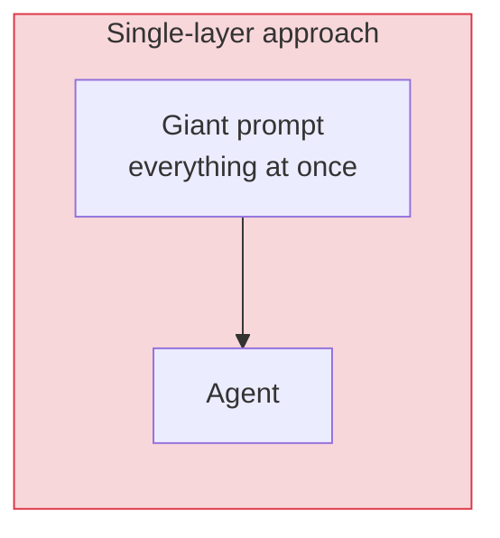
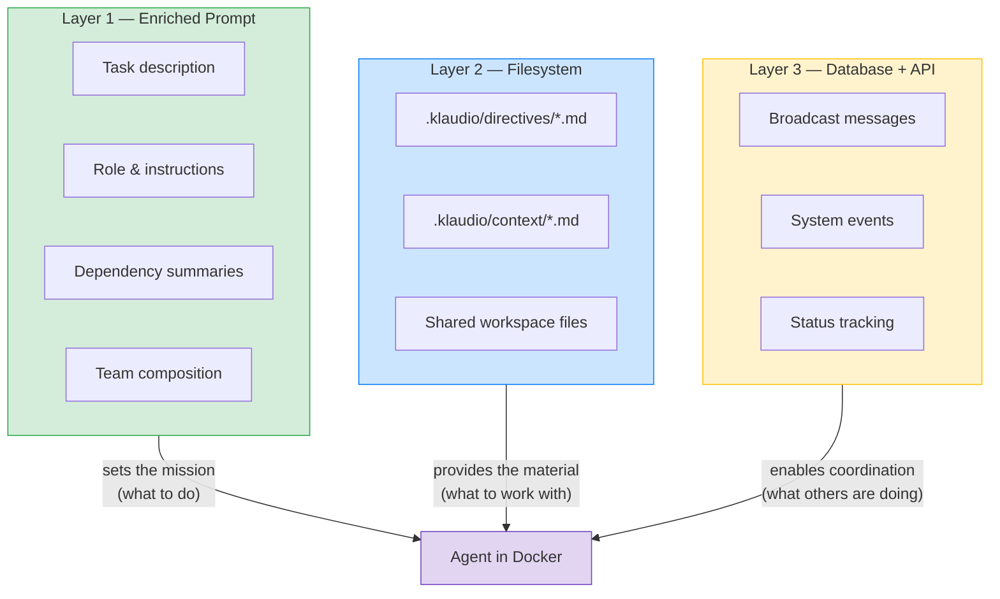
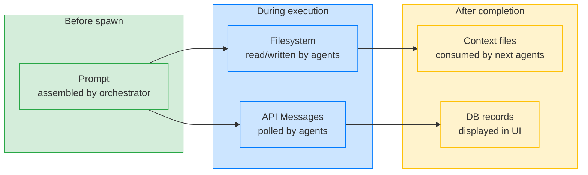
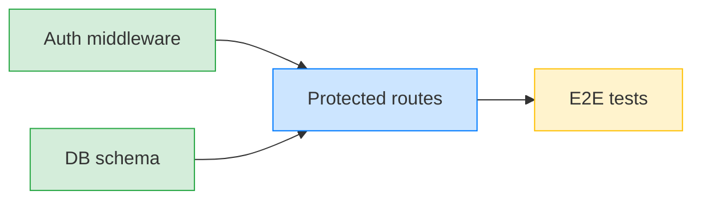
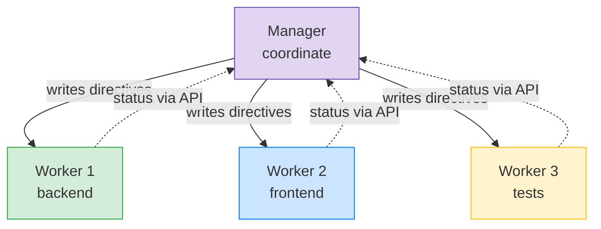
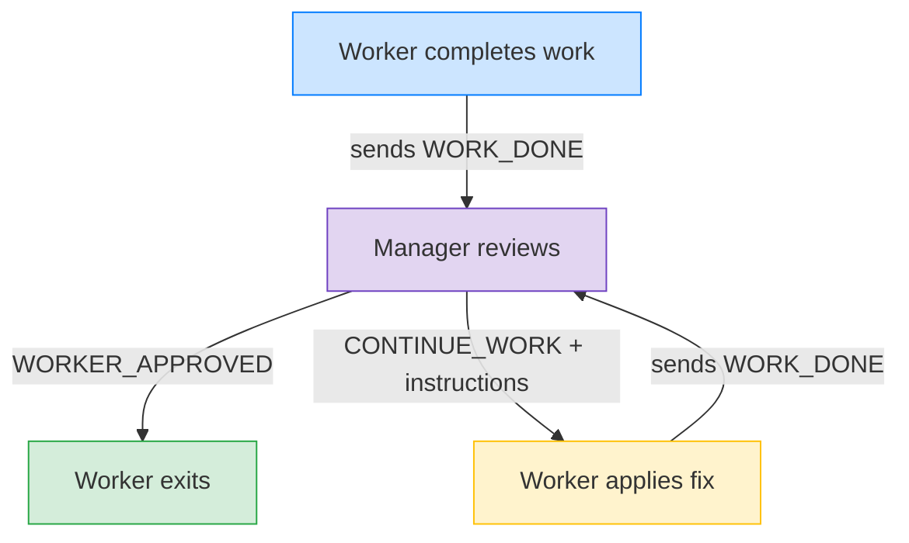
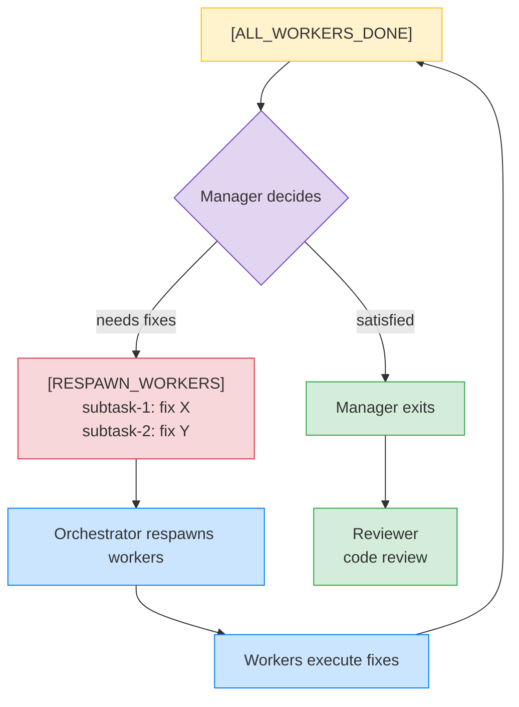
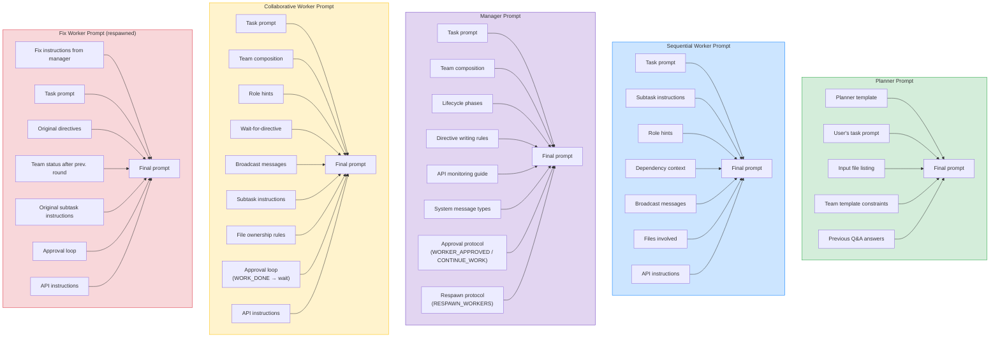
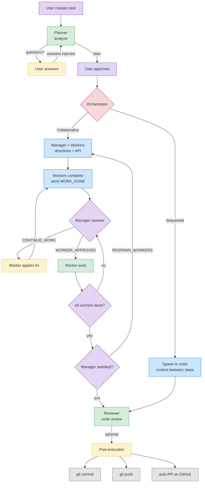

# Klaudio — Context Management & Architecture

## The Idea

Klaudio is an **AI agent orchestrator**. Its purpose is to take a complex software development task, break it down into subtasks, and have them executed by multiple Claude Code instances running in isolated Docker containers.

The core problem is: **how to give each agent the right context at the right time**, without agents stepping on each other's toes.

The solution is a multi-layered system that combines:
- **Enriched prompts** (dynamically built before each spawn)
- **Shared filesystem** (a workspace volume mounted into each container)
- **Database-backed messaging** (inter-agent communication via REST API)
- **Directive files** (manager→worker coordination via Markdown)

---

## Why a Layered Context System?

A naive approach would be to dump all context into a single giant prompt and let the agent figure it out. This breaks down quickly with multiple agents working on a real codebase. Klaudio uses layered context because each layer solves a different problem that the others can't:

### The Problem with a Single Layer



- **Prompt-only**: LLM context windows are finite. Stuffing the full codebase, all messages, and all coordination rules into one prompt would blow the token limit — and even if it fit, the agent would lose focus on what matters.
- **Filesystem-only**: Agents in different containers can't easily discover what other agents have done or are doing. There's no notification mechanism — just files sitting on disk.
- **Database-only**: Agents run Claude Code, which naturally reads and writes files. Forcing all communication through API calls adds friction and goes against how Claude Code works best.

### How the Layers Complement Each Other



| Layer | What it carries | Why it's the right medium | What would break without it |
|-------|----------------|--------------------------|---------------------------|
| **Prompt** | Mission, role, instructions, summaries of prior work | Arrives before the agent starts — sets intent and focus from the first token | Agents wouldn't know what to do or what already happened |
| **Filesystem** | Directives, completion context, actual code | Claude Code naturally reads/writes files — zero friction | Manager couldn't coordinate workers; sequential agents couldn't see prior results |
| **Database + API** | Real-time messages, system events, status | Works across container boundaries, supports polling | Agents in isolated containers would have no way to communicate during execution |

### The Key Insight

Each layer operates at a **different point in time** and serves a **different audience**:



- **Prompt** = what you know **before** work begins (static, curated, focused)
- **Filesystem** = what you produce and consume **during** work (natural for code agents)
- **Database** = what needs to cross container boundaries or persist for the **UI** (structured, queryable)

This separation means each agent gets a **focused, relevant** context window instead of an overwhelming dump, while still having access to everything it needs through the appropriate channel at the appropriate time.

---

## How It Works, Step by Step

### 1. The User Creates a Task

The user submits a prompt (e.g., "Add JWT authentication to the project") and optionally:
- Input files (uploaded via API)
- A Git repository to clone
- A team template (predefined roles)

### 2. The Planner Analyzes

A **planner** agent is launched in a Docker container with the workspace mounted **read-only**. It cannot modify anything — only analyze.

The planner receives in its prompt:
- The user's task description
- The list of input files
- Team template constraints (roles, max agents)
- Answers to previously asked questions (if any)

The planner can do one of two things:
1. **Ask clarifying questions** → questions are saved to the DB, the user answers via the UI, and the planner is re-run with the answers injected into its prompt
2. **Produce a plan** → a structured JSON with subtasks, dependencies, and files involved

### 3. The User Approves the Plan

The plan is displayed in the UI. The user can approve, modify, or reject it.

### 4. Execution: Two Modes

#### Sequential Mode (DAG)

Subtasks are executed respecting a dependency graph:



**Context flow:**
1. The orchestrator finds "ready" tasks (no pending dependencies)
2. For each one, it collects:
   - Context from completed dependencies (files at `.klaudio/context/{subtaskID}.md`)
   - Broadcast messages from other agents (from DB)
3. Builds an enriched prompt with all collected context
4. Spawns the Docker container
5. When the agent finishes, it saves a **completion summary** to:
   - `.klaudio/context/{subtaskID}.md` (filesystem, for subsequent agents)
   - `agent_messages` table (DB, for the UI and API queries)
6. Releases file locks and looks for the next ready task

**File locking:** each subtask declares which files it touches. The lock manager prevents two agents from modifying the same file concurrently. If a task is ready but its files are locked by another agent, it is deferred.

#### Collaborative Mode (Manager + Workers)

All agents work **in parallel**, coordinated by a manager:



**Phase 1 — Manager spawns first:**
- Receives the task prompt, team composition, and the API URL
- Writes directive files to `.klaudio/directives/`:
  - `coordination.md` → shared contracts, naming conventions, file ownership
  - `{subtaskID}.md` → specific instructions for each worker

**Phase 2 — Workers spawn immediately (in parallel):**
- Each worker starts but **waits** for its directive:
  ```bash
  while [ ! -f .klaudio/directives/{subtaskID}.md ]; do
    echo 'Waiting for manager directives...'
    sleep 3
  done
  ```
- Once the directive appears, the worker reads it and begins working

**Phase 3 — Work, review, and fix loops:**

Workers do **not** exit when they finish their work. Instead, each worker sends a `[WORK_DONE]` message and enters an **approval loop**, polling for the manager's response:



The manager stays alive and polls the API every 10–15 seconds. For each worker that reports `[WORK_DONE]`, the manager can:

- **`[WORKER_APPROVED]`** → the worker exits cleanly
- **`[CONTINUE_WORK]` + fix instructions** → the worker reads the instructions, applies the fix, sends `[WORK_DONE]` again, and waits for another review. This can repeat as many times as needed.

The manager also sees system messages (`[WORKER_COMPLETED]`, `[WORKER_FAILED]`) and can send additional guidance via broadcast messages at any time.

**Phase 4 — Completion and optional respawn:**

When all workers have exited (approved or otherwise), the orchestrator sends `[ALL_WORKERS_DONE]` to the manager. The manager then has two choices:

1. **Exit** → orchestration ends, optional reviewer runs
2. **Send `[RESPAWN_WORKERS]`** → the orchestrator respawns specific workers with new fix instructions



The respawn mechanism is a **fallback** for when a worker has already exited (crash, timeout) or needs a complete redo. The inline `CONTINUE_WORK` approach is preferred for small fixes because it preserves the worker's context and avoids the overhead of spawning a new container.

There is **no limit** on the number of fix rounds — the manager continues until satisfied.

Optionally, a **reviewer** agent performs a final code review after the manager exits.

---

## Communication Channels

| Channel | Medium | Direction | When |
|---------|--------|-----------|------|
| **Enriched prompt** | Env var `CLAUDE_PROMPT` | Orchestrator → Agent | Before spawn |
| **Directive files** | `.klaudio/directives/*.md` | Manager → Workers | Start of collaboration |
| **Context files** | `.klaudio/context/*.md` | Agent N → Agent N+1 | After completion (seq.) |
| **Broadcast messages** | DB `agent_messages` via REST API | Agent ↔ Agent | During execution |
| **Approval signals** | DB `agent_messages` via REST API | Manager → Worker | `[WORKER_APPROVED]`, `[CONTINUE_WORK]` |
| **Work done signals** | DB `agent_messages` via REST API | Worker → Manager | `[WORK_DONE]` + summary |
| **System messages** | DB `agent_messages` | Orchestrator → Manager | `[WORKER_COMPLETED]`, `[WORKER_FAILED]`, `[ALL_WORKERS_DONE]`, `[WORKERS_RESPAWNED]` |
| **Respawn requests** | DB `agent_messages` via REST API | Manager → Orchestrator | `[RESPAWN_WORKERS]` + subtask list |
| **Shared workspace** | Docker volume mount | All agents | Always |

---

## How Prompts Are Built

Prompts are not static. They are **dynamically assembled** by the orchestrator before each spawn, combining different blocks depending on the agent's role:



---

## The Docker Container

Each agent runs in an isolated container based on `klaudio-agent`:

- **Base**: Node.js 22 + Claude Code CLI
- **User**: `agent` (non-root)
- **Working dir**: `/home/agent/workspace` (volume-mounted from host)
- **Auth**: `.credentials.json` and `settings.json` copied by the entrypoint into `~/.claude/`
- **Startup**: the entrypoint runs:
  ```bash
  claude --dangerously-skip-permissions \
    --output-format stream-json \
    --verbose \
    -p "$CLAUDE_PROMPT"
  ```

The prompt arrives as the **environment variable** `CLAUDE_PROMPT`. Output is streamed as JSON for real-time parsing by the orchestrator.

---

## Full Lifecycle



---

## Key Architectural Decisions

| Decision | Rationale |
|----------|-----------|
| Read-only planner | Separation of analysis and execution, security |
| Prompt via env var | Simplicity, no extra files to mount |
| Dual persistence (filesystem + DB) | Files for agents, DB for the UI |
| Directives via filesystem | Manager writes, workers read — natural for Claude Code |
| Messages via API/DB | Async communication between isolated containers |
| File lock service | Prevents write conflicts between parallel agents |
| Ephemeral containers | State lives in the workspace and DB, containers are disposable |
| Shared workspace | A single mounted volume per task, all agents see the same files |
| Workers wait for approval | Manager reviews each worker's output before it exits — enables inline fixes without respawn |
| Two-tier fix mechanism | `CONTINUE_WORK` for inline fixes (fast, preserves context), `RESPAWN_WORKERS` for full rework (fallback) |
| No fix round limit | Manager decides when quality is sufficient — unlimited iterations |
